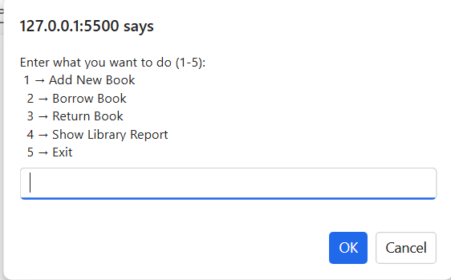

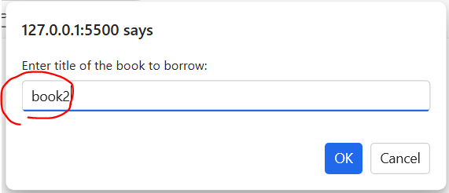
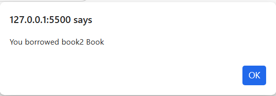
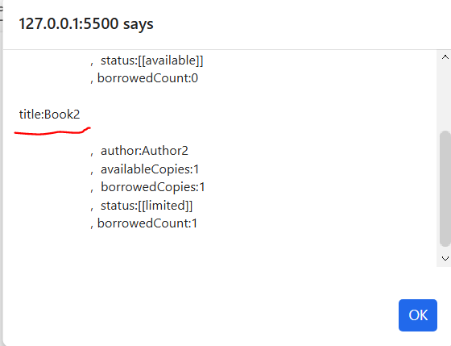
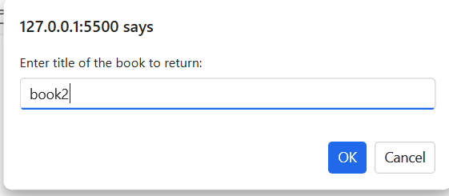
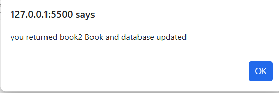
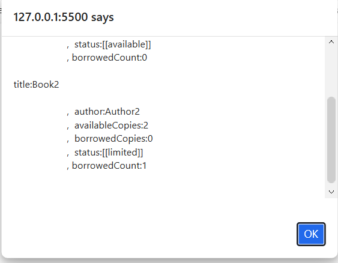
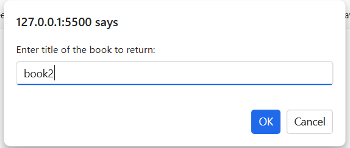
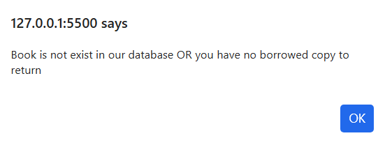
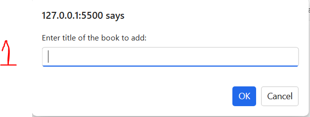
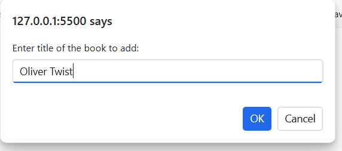
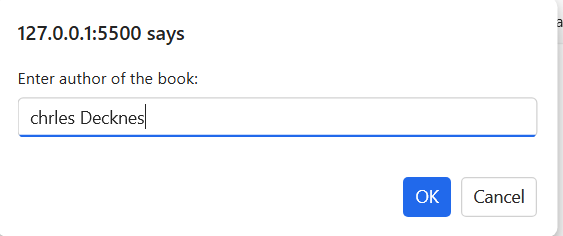


```html
<!DOCTYPE html>
<html lang="en">
<head>
    <meta charset="UTF-8">
    <meta name="viewport" content="width=device-width, initial-scale=1.0">
    <title>Document</title>
</head>
<body>
    
    <h1>Library Management System</h1>

    <script>


function EnterTitle(text){
    let title="";
    do{
        title=prompt(text);
        if(title.length>0){
            return title;
        }else{
            alert("title cannot be empty");
            console.log("title cannot be empty");
        }
    }while(title.length===0);
    return title;
}

function checkBookAvailability(title){

    for(let i=0;i<books.length;i++){
        if(books[i].title.toLowerCase()===title.toLowerCase()){
            return  Number(i);
        }
    }
    return  Number(-1);
}
function borrowBook(title){
    let bookIndex=checkBookAvailability(title);
    if(bookIndex!==-1){
        let bookToBorrow=books[bookIndex];
        if(books[bookIndex].AvailableCopies>0){
            books[bookIndex].AvailableCopies--;
            books[bookIndex].BorrowedCopies++;
            books[bookIndex].borrowedCount++;
            alert(`You borrowed ${title} Book`);
            return true;  // Boom Boom
        }else {
            alert(`sorry, ${title} is out of stock`);
            return false;  //// Boom Boom
        }
    }  
    else{
        alert("Book is not exist in our database");
        return false;   // Boom Boom
    }

}

function returnBook(title){        
    let bookIndex=checkBookAvailability(title);
    if(bookIndex!==-1){
        books[bookIndex].AvailableCopies++;
        console.log(`You returned ${title} Book`);
    }else{
        console.log("Book is not exist in our database");
    }
}
function calculateTotalBooks(_books){
    let totAvailable=0;
    let totBorrowed=0;
    for(let i=0;i<_books.length;i++){
        totAvailable+=_books[i].AvailableCopies;
        totBorrowed+=_books[i].BorrowedCopies;
    }
    return {totalBooks:_books.length,totalAvailable:totAvailable,totalBorrowed:totBorrowed};
}

function showLibraryReport(_books){
    alert("##### Library Report #####:\n");
    let listOfBooks=""
    for(let i=0;i<_books.length;i++){
        // alert(`title:${_books[i].title}
        // , author: ${_books[i].author}
        // , available Copies: ${_books[i].AvailableCopies}
        // , borrowed Copies: ${_books[i].BorrowedCopies}`);
        let classification="";
        if(_books[i].AvailableCopies>2){
            classification="available"; 
        }else if(_books[i].AvailableCopies>0){
            classification="limited";
        }else{
            classification="out of stock";   
        }
        listOfBooks+=`title:${_books[i].title} \n
                    ,  author:${_books[i].author}
                    ,  availableCopies:${_books[i].AvailableCopies}
                    ,  borrowedCopies:${_books[i].BorrowedCopies} 
                    ,  status:[[${classification}]]
                    , borrowedCount:${_books[i].borrowedCount}
                    \n`;
                                    }
        alert(listOfBooks);
}


// start of the system

        let book={title:"",author:"",AvailableCopies:0,BorrowedCopies:0,borrowedCount:0};
        console.log(book);
        // console.log(book.title , book.author , book.AvailableCopies , book.BorrowedCopies);

        let books=[
            {title:"Book1",author:"Author1",AvailableCopies:5,BorrowedCopies:0,borrowedCount:0},
            {title:"Book2",author:"Author2",AvailableCopies:2,BorrowedCopies:0,borrowedCount:0},
            // {title:"Book3",author:"Author3",AvailableCopies:0,BorrowedCopies:0,borrowedCount:0}
        ];
        console.log("1 → Add New Book 2 → Borrow Book 3 → Return Book 4 → Show Library Report 5 → Exit");


        let choice=-1;
        let Continue=true;
        do{
            do{
            choice=prompt("Enter what you want to do (1-5): \n 1 → Add New Book\n  2 → Borrow Book\n  3 → Return Book\n  4 → Show Library Report\n  5 → Exit");
            }
            while( !(choice>="1" && choice<="5"));
        
            switch(choice)
            {   
                    case "1": // add new book
                        let _title=EnterTitle("Enter title of the book to add:");
                        let bookIndex=checkBookAvailability(_title);
                            if(bookIndex!==-1){
                                books[bookIndex].AvailableCopies++;
                                alert(`You added  a copy of ${_title} Book to our database`);
                                showLibraryReport(books);
                            }
                            else{
                                let _author=prompt("Enter author of the book:");
                                let _copies=parseInt(prompt("Enter number of copies:"));
                                let _borrowedCopies=0;
                                books.push({title:_title,author:_author,AvailableCopies:_copies,BorrowedCopies:_borrowedCopies ,borrowedCount:0});
                                console.log(` you added Book ${_title} to our database`);
                                showLibraryReport(books);
                                }    
                        break;
                    case "2": // borrow book
                        let BookTitle=EnterTitle("Enter title of the book to borrow:");
                        
                        if(checkBookAvailability(BookTitle)!==-1){
                            if(borrowBook(BookTitle))
                                {
                                alert(`you borrowed ${BookTitle} Book and database updated`);            
                                }
                            showLibraryReport(books);    
                        }
                        else{
                        console.log("no copy available");
                        }
                        
                        break;
                    case "3": // return book
                        let BookToReturn=EnterTitle("Enter title of the book to return:");
                        returnBook(BookToReturn); 
                        alert(`you returned ${BookToReturn} Book and database updated`);
                        showLibraryReport(books);
                        break;
                    case "4": // show report
                        showLibraryReport(books);
                        let avBooks_borBooks=calculateTotalBooks(books);
                        console.log(` available Copies:${avBooks_borBooks.totalAvailable},Borrowed Copies:${avBooks_borBooks.totalBorrowed}`);
                        break;
                    case "5": // exit
                        console.log("Exiting the system. Goodbye!");
                        Continue=false;
                        break;
            }
           // Continue=confirm("Are you sure you want to exist");
        }while(Continue);

    </script>
</body>
</html>
```

