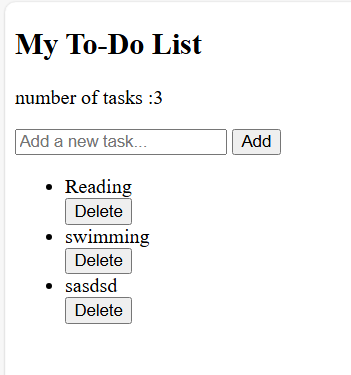
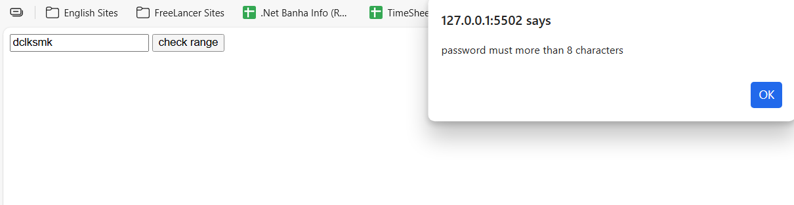
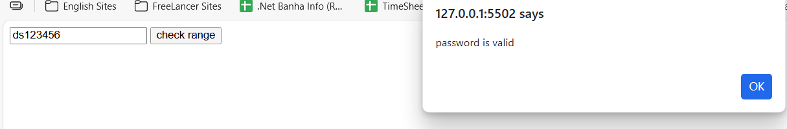
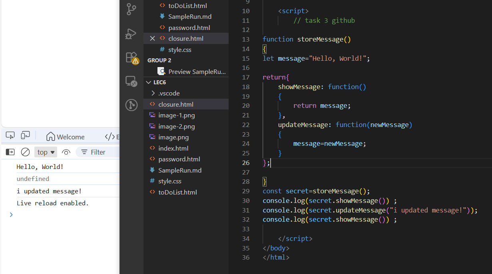

```html

<!DOCTYPE html>
<html lang="en">
<head>
    <meta charset="UTF-8">
    <meta name="viewport" content="width=device-width, initial-scale=1.0">
    <title>Document</title>
</head>
<body>
   <!-- // task 1 to upload on github  -->
   <div class="todo-container">
        <h2>My To-Do List</h2>
        <p id="counter">number of tasks : 0</p> 
        <input type="text" id="taskInput" placeholder="Add a new task..."> 
        <button onclick="addTask()">Add</button>  
        <ul id="taskList"></ul>
     </div>

    <script>
        // task 6 to upload on github
//task 6 on my own to complete github
let taskCount = 0;
function updateCounter()
{
    document.getElementById("counter").textContent="number of tasks :" + taskCount; 
}

function addTask()
{
    let myInput= document.getElementById("taskInput").value;
    if(myInput.length===0)
    {
        alert("pls enter a task.");
        return;
    }
    let li=document.createElement("li");
    li.textContent=myInput;
    document.getElementById("taskList").appendChild(li);

    let btn_delete=document.createElement("button");
    btn_delete.textContent="Delete";
    document.getElementById("taskList").appendChild(btn_delete);
    btn_delete.onclick=function()
    {
        
        // btn_delete.previousElementSibling.remove(); //1st approach 
        li.remove();                                    //2nd approach    
        btn_delete.remove();
        taskCount--;
        updateCounter();
    }
    taskCount++;
    updateCounter();
    document.getElementById("taskInput").value = ""; 
}
    </script>
</body>
</html>
```



```html
<!DOCTYPE html>
<html lang="en">
<head>
    <meta charset="UTF-8">
    <meta name="viewport" content="width=device-width, initial-scale=1.0">
    <title>Document</title>
</head>
<body>

    <input type="text" id="textBox" placeholder="Enter password">
    <button onclick="check8()">check range </button>
    <script>
            //task 8 push also in github
            let myInput=document.getElementById("textBox");
            function check8()
            {
                if(myInput.value.length<8 )
                {
                    alert("password must more than 8 characters");
                    throw new Error("password must more than 8 characters");
                }
                else
                {
                    alert("password is valid");
                }
            }
    </script>
</body>
</html>
```
<!-- start -->


```html
<!DOCTYPE html>
<html lang="en">
<head>
    <meta charset="UTF-8">
    <meta name="viewport" content="width=device-width, initial-scale=1.0">
    <title>Document</title>
</head>
<body>
    
    <script>
        // task 3 github

function storeMessage()
{
let message="Hello, World!";

return{
    showMessage: function()
    {
        return message;
    },
    updateMessage: function(newMessage)
    {
        message=newMessage;
    }
};

}
const secret=storeMessage();
console.log(secret.showMessage()) ;
console.log(secret.updateMessage("i updated message!"));
console.log(secret.showMessage()) ;

    </script>
</body>
</html>

```
