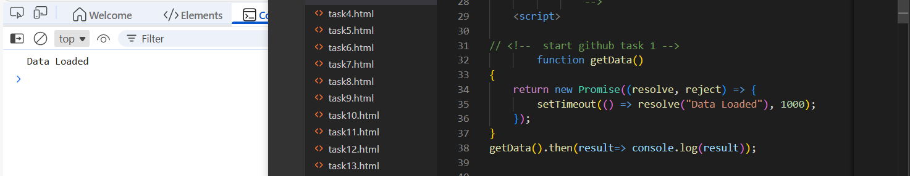
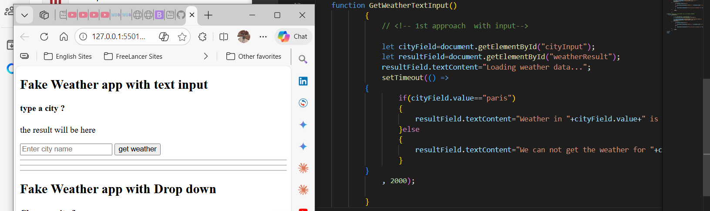
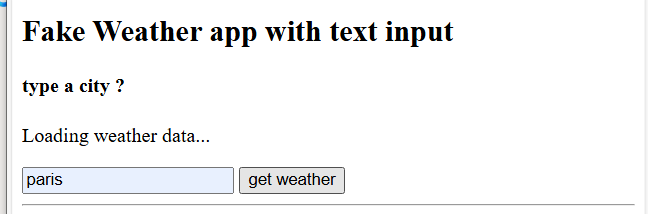
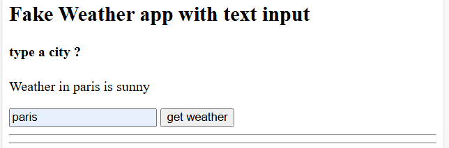
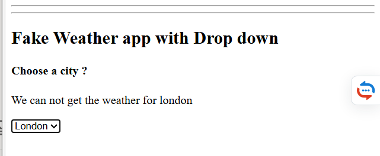

# Task 1



```javascript


// <!--  start github task 1 -->
        function getData()
{
    return new Promise((resolve, reject) => {
        setTimeout(() => resolve("Data Loaded"), 1000);
    });
}
getData().then(result=> console.log(result));  
```
    
# Task 2 & Task 3






```html

<!DOCTYPE html>
<html lang="en">
<head>
    <meta charset="UTF-8">
    <meta name="viewport" content="width=device-width, initial-scale=1.0">
    <title>Document</title>
</head>
<body>
    

    <h2>Fake Weather app with text input </h2>
    <!-- ######## github task 2 Fake Weather app with text input  ########-->
    <h4>type a city ?</h4>
    <p id="weatherResult"> the result will be here</p>
    <input type="text" id="cityInput" placeholder="Enter city name">
    <button onclick="GetWeatherTextInput()" id="myInput"> get weather</button>
            
<hr><hr><hr>
    <!-- ######## github task 3 Fake Weather app with with Drop down  ########-->
     <h2>Fake Weather app with Drop down </h2>
                <h4>Choose a city ?</h4>
                <p id="weatherResultDropDown"> the result will be here</p>
                <select onchange="GetWeather()" name="countries" id="myDropDown" >
                    <option value="paris">Paris</option>
                    <option value="cairo">Cairo</option>
                    <option value="london">London</option>
                </select>
               
    <script>

// <!--  start github task 1 -->
//         function getData()
// {
//     return new Promise((resolve, reject) => {
//         setTimeout(() => resolve("Data Loaded"), 1000);
//     });
// }
// getData().then(result=> console.log(result));  
// <!--  end github task 1 -->

    // ######## github task 2 Fake Weather app with text input ########
            
    function GetWeatherTextInput()
            {
                // <!-- 1st approach  with input-->

                let cityField=document.getElementById("cityInput");
                let resultField=document.getElementById("weatherResult");
                resultField.textContent="Loading weather data...";
                setTimeout(() =>
            {
                    if(cityField.value=="paris")
                    {
                        resultField.textContent="Weather in "+cityField.value+" is sunny";
                    }else
                    {
                        resultField.textContent="We can not get the weather for "+cityField.value;
                    }
            }
                , 2000);
                
            }
            
//######## github task 3 Fake Weather app with DropDown ########
    function GetWeather()
            {
                // <!-- 2nd approach  with Drop down -->
                let cityField=document.getElementById("myDropDown");
                
                let resultField=document.getElementById("weatherResultDropDown");
                resultField.textContent="Loading weather data...";
                setTimeout(() =>
            {
                    if(cityField.value=="paris")
                    {
                        resultField.textContent="Weather in "+cityField.value+" is sunny";
                    }else
                    {
                        resultField.textContent="We can not get the weather for "+cityField.value;
                    }
            }
                , 2000);   
            }
</script>
</body>
</html>
```

